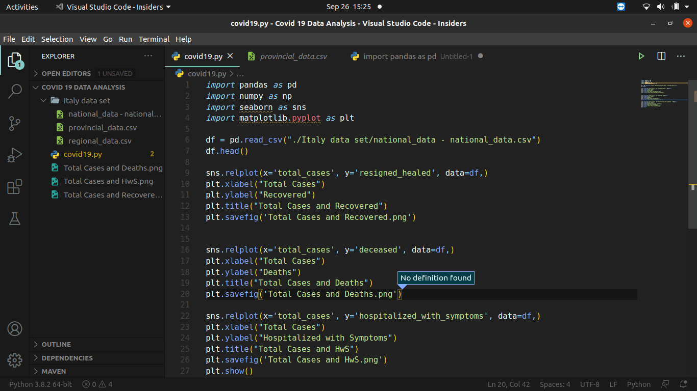
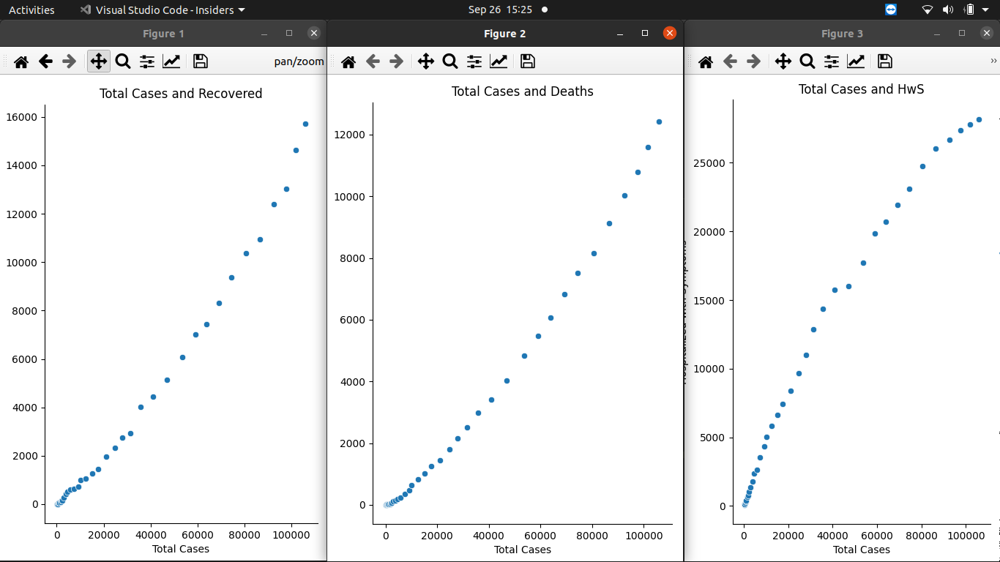

<h1>Covid-19_Data_Anaylysis.py</h1>
 

This program uses a dataset provided by Kaggle about the covid-19 data base in Italy
and visualises the data into different rel plots using matplotlib library and seaborn library

**Working**
- The program open ups the data provide by Kaggle into a dataframe and reads it
- It then plot 3 different graphs one after the another
- 3 Diffrent graphs plotted between total Covid-19 cases, recovered patients, deaths and hospitalized with symptoms

 

 

**After execution the program stores the plotted graph in the destination folder as well**

 
#Output

